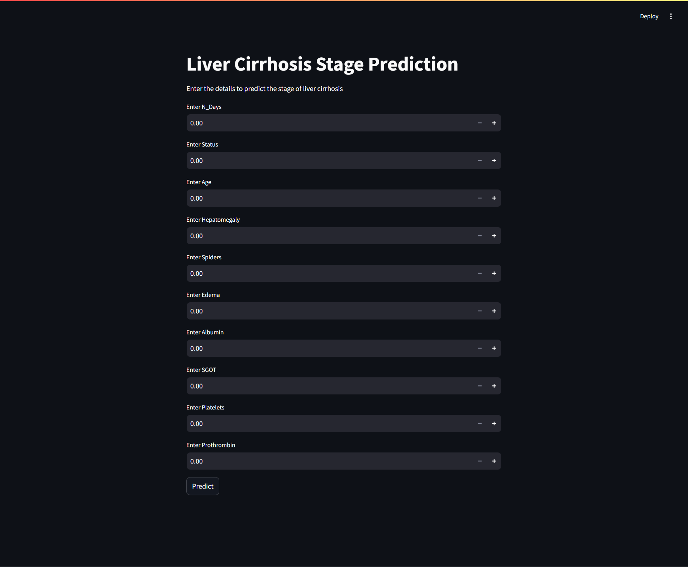

Here's a detailed and well-structured `README.md` file for your project **Optimizing Liver Cirrhosis Stage Classification**, based on the provided files and project purpose.

---

### ✅ `README.md`

```markdown
# 🩺 Optimizing Liver Cirrhosis Stage Classification

This project demonstrates the power of **data preprocessing**, **feature selection**, and **model optimization** in classifying stages of **liver cirrhosis**. It includes a machine learning pipeline that uses **SMOTE for class imbalance**, **Random Forest for classification**, and model **interpretability tools** for clinical insights.

---

## 📌 Key Highlights

- ✅ **SMOTE**: Balances dataset by synthetically oversampling minority classes
- ✅ **Feature Selection**: Identifies the most predictive features using model-based and statistical techniques
- ✅ **Random Forest**: Achieved the best performance among several models
- ✅ **Model Serialization**: Includes `scaler.pkl`, `selector.pkl`, and `selected_features.pkl` for easy deployment
- ✅ **Web Interface**: Simple `Streamlit` app for predictions using trained model

---

## 📁 File Structure

```

Optimizing-Liver-Cirrhosis-Stage-Classification/
├── app.py                          # Streamlit app for stage prediction
├── liver\_cirrhosis.csv             # Original dataset
├── scaler.pkl                      # StandardScaler used in preprocessing
├── selector.pkl                    # Feature selector object (e.g., SelectFromModel)
├── selected\_features.pkl           # List of selected top features
├── RF\_stage\_model\_train\_download\_link.txt  # Link or log related to trained RF model
├── app-01-05-2025\_11\_22\_AM.png     # Screenshot of the deployed app
└── README.md                       # Project documentation

````

---

## 🚀 How to Run

### 🔧 Requirements

Install dependencies:

```bash
pip install pandas scikit-learn streamlit imbalanced-learn
````

### ▶️ Run the App

```bash
streamlit run app.py
```

The app will open in your default browser where you can input feature values and predict liver cirrhosis stage.

---

## 📊 Dataset Overview

* 📄 **File**: `liver_cirrhosis.csv`
* 🧬 **Features**: Multiple clinical biomarkers and demographic variables
* 🎯 **Target**: Cirrhosis Stage (e.g., early, mid, advanced)

---

## 🧠 Model Pipeline

1. **Preprocessing**

   * Handle missing values
   * Feature scaling using `StandardScaler`

2. **Balancing**

   * Apply `SMOTE` to address class imbalance

3. **Feature Selection**

   * Model-based selection (e.g., `SelectFromModel`)
   * Selected features stored in `selected_features.pkl`

4. **Model Training**

   * Trained a `Random Forest Classifier`
   * Saved model artifacts for deployment

---

## 📈 Performance

* **Best Model**: Random Forest
* **Evaluation Metrics**: Accuracy, Precision, Recall, F1-score, ROC-AUC
* **Result**: Random Forest outperformed other models after SMOTE and feature selection

---

## 🧪 Testing

Since this is an interactive app, you can test it manually:

1. Run the app with `streamlit run app.py`
2. Input sample data
3. Check predicted cirrhosis stage

For automated testing:

* Add unit tests for data transformation and model inference
* Use `pytest` or `unittest`

---

## 🤝 Contribution

Contributions are welcome! To contribute:

1. Fork the repository
2. Create a new branch: `feature/your-feature`
3. Commit your changes
4. Open a Pull Request

---

## 📜 License

This project is under the MIT License.

---

## 📸 Screenshot



---

## ⭐ Acknowledgments

* **imbalanced-learn** for SMOTE
* **scikit-learn** for ML models and pipeline tools
* **Streamlit** for the interactive front end

---

## 🌟 Give It a Star

If you found this helpful or inspiring, consider giving it a ⭐ and sharing it!

```

Let me know if you’d like to:
- Add a model download link
- Include metrics in a table format
- Extend this to a hosted demo (e.g., Hugging Face or Streamlit Cloud)
```
